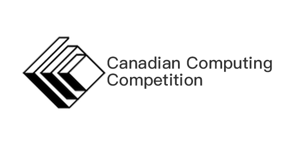

# CCC
[](https://travis-ci.org/yan-ren/CCC)
[](https://codecov.io/gh/yan-ren/CCC)


This repository contains the unofficial solutions to the [Canadian Computing Competition](https://cemc.math.uwaterloo.ca/contests/computing.html). Solutions are inspired by various sources, including personal solutions, online resources, and [Milliken Mills CCC repository](http://mmhs.ca/ccc/index.htm).

My solution deviates from the [CCC Java code standard](https://cemc.uwaterloo.ca/contests/computing/examples.html) because of the testing purpose. I use JUnit framework to implement the test cases for each solution to demonstrate how each solution is tested against the test data. You must to follow the CCC code standard if you plan to write the contest.

**All solutions are tested by the complete test data set provided by [CCC official website](https://cemc.math.uwaterloo.ca/contests/past_contests.html)**

## Folder Structure

```sh
.
├── src/main/java
├── src/test/java
└── src/test/resources
```

- `src/main/java`
    - contains source code, organized by years in different package
- `src/test/java`
    - contains test cases, organized by years in different package
- `src/test/resources`
    - contains test data files

## Support  
[](https://www.paypal.com/cgi-bin/webscr?cmd=_donations&business=PNBG2C3WK35YW&currency_code=CAD&source=url)

Thank you for all your support, I will keep making quality solutions.
